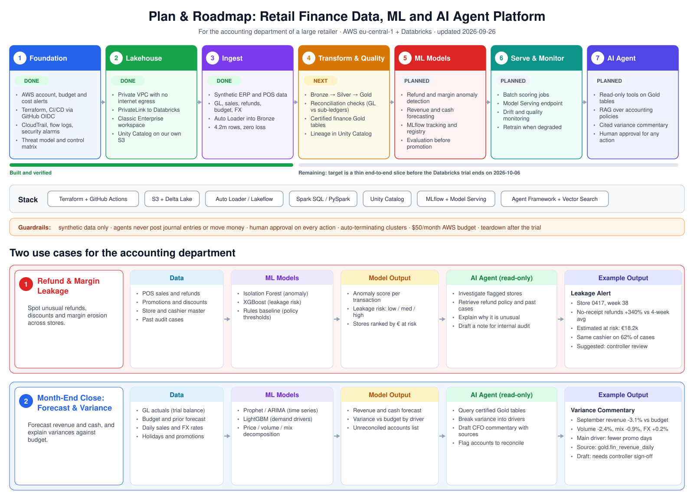

# Status and roadmap

**Contents:** [TL;DR](#tldr) · [Roadmap](#roadmap) · [Where we are](#where-we-are) · [Where we go](#where-we-go) · [Use cases](#use-cases) · [Deadlines and cost](#deadlines-and-cost) · [Open risks](#open-risks) · [Scope rule](#scope-rule)

Updated 2026-09-27. Detail: [`cmdb.yml`](cmdb.yml) → `phases`, `progress`. Architecture: [HLD](docs/architecture/hld.md). How we built it: [stories](docs/stories/README.md). Rules for assistants: [AGENTS.md](AGENTS.md).

## TL;DR

| Question | Answer |
|---|---|
| Goal | Show how a large retailer's accounting department could run governed finance data, ML and an AI agent on AWS + Databricks, built the enterprise way |
| The plan in one line | Raw ERP and POS data → governed lakehouse → finance models → an agent that drafts cited commentary for the controller to approve |
| Agent boundary | May investigate, summarise, recommend. Never posts entries, moves money or approves payments: a human signs off |
| Where are we? | Stages 1-3 done; stage 4: Silver clean, reconciliation 4/4 with 0 false alarms, Gold tables live (both other frauds surface unprompted) |
| What is next? | Quality and lineage evidence (4.4), service principal split (4.5), then ML (stage 5) |
| Deadline | Databricks trial ends 2026-10-06, teardown that day |
| Running cost | ~USD 2/day network + trial credit for Databricks |

## Roadmap

## Where we are

> **TL;DR:** 3 of 7 stages done. Detail: [`cmdb.yml`](cmdb.yml) → `phases`, `progress`, `stories`

| # | Stage | Status | Done when | Stories |
|---|---|---|---|---|
| 1 | Foundation | ✅ Done | Terraform, CI/CD, audit trail, security alarms, budget in place | [1.1-1.5](docs/stories/README.md#epic-1--foundation) |
| 2 | Lakehouse | ✅ Done | Private Databricks workspace, no internet, Unity Catalog on our S3 | [2.1-2.5](docs/stories/README.md#epic-2--lakehouse) |
| 3 | Ingest | ✅ Done | 40 stores, 21 months of synthetic data in Bronze: 4.2m rows, zero loss | [3.1-3.3](docs/stories/README.md#epic-3--ingest) |
| 4 | Transform & Quality | ⏳ In progress | Gold finance tables reconcile to controlled inputs | [4.1](docs/stories/4.1-silver-tables.md) ✅, [4.2](docs/stories/4.2-gl-pos-reconciliation.md) ✅, [4.3](docs/stories/4.3-gold-finance-tables.md) ✅, [4.4-4.5](docs/stories/README.md#epic-4--transform--quality) |
| 5 | ML Models | Planned | Refund fraud, margin leakage and forecast models tracked in MLflow | |
| 6 | Serve & Monitor | Planned | Models score on a schedule, with drift checks | |
| 7 | AI Agent | Planned | Cited variance commentary; no action without human approval | |

## Where we go

> **TL;DR:** reconciliation, then Gold, then models and the agent reading Gold only.
> What the layers mean: [LLD 3 · Bronze, Silver, Gold](docs/architecture/lld-data-platform.md#bronze-silver-gold).
> Acceptance criteria: stories [4.1](docs/stories/4.1-silver-tables.md) · [4.2](docs/stories/4.2-gl-pos-reconciliation.md) · [4.3](docs/stories/4.3-gold-finance-tables.md) · [4.4](docs/stories/4.4-quality-and-lineage.md)

1. ~~**Silver:** real types, bad rows set aside, nothing lost~~ ✅ done 2026-09-27.
2. ~~**Reconciliation:** the general ledger matches the sales~~ ✅ done 2026-09-27: 4/4 fake journals, 0 false alarms.
3. ~~**Gold:** daily revenue, margin, refunds, actual vs budget~~ ✅ done 2026-09-27.
4. **Models, then the agent,** reading Gold only.

## Use cases

> **TL;DR:** two jobs the accounting team cares about. Detail: [`cmdb.yml`](cmdb.yml) → `program.needs`

| Use case | What it gives finance |
|---|---|
| Refund & margin leakage | Unusual refunds and margin erosion, by store and cashier |
| Month-end close | Revenue and cash forecast, variance vs budget explained |

## Deadlines and cost

> **TL;DR:** one hard date, small daily cost. Detail: [`cmdb.yml`](cmdb.yml) → `risks`

| Item | Value |
|---|---|
| Databricks trial ends | **2026-10-06**, tear down that day ([runbook](https://github.com/kheuchi/retail-finance-platform-infra/blob/main/docs/runbooks/teardown.md)) |
| Service principal secret expires | ~2026-10-08 |
| Private network | ~USD 2/day |
| Job runs | A few cents each |
| Databricks usage | USD 400 trial credit, alerts at 100, 200, 300, 380 |

## Open risks

> **TL;DR:** five that matter now. Detail: [`cmdb.yml`](cmdb.yml) → `risks`

| Risk | State |
|---|---|
| GitHub 2FA off | Accepted (owner decision) |
| Network costs above budget if left on | Teardown 2026-10-06 |
| Trial converts to paid on 2026-10-06 | Teardown or cancel that day |
| Databricks secret expires ~2026-10-08 | Move to OIDC federation |
| One service principal does platform, deploy and run-as | Split after Gold ([story 4.5](docs/stories/4.5-split-service-principals.md)) |

## Scope rule

> **TL;DR:** cut features, never controls. Detail: [`cmdb.yml`](cmdb.yml) → `rules`

If time runs short, keep one thin end-to-end slice working and drop extra datasets or
models, never the security, lineage or teardown.

