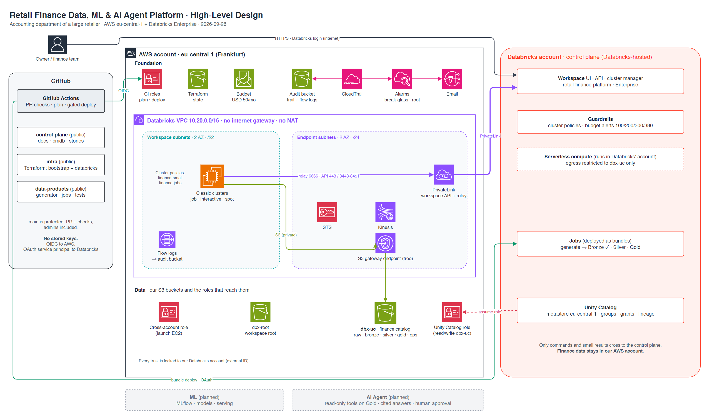

# High-Level Design

**Contents:** [TL;DR](#tldr) · [Diagram](#diagram) · [The four zones](#the-four-zones) · [Key flows](#key-flows) · [Design choices](#design-choices) · [Zoom in (LLDs)](#zoom-in-llds) · [Edit the diagram](#edit-the-diagram)

Updated 2026-09-26. Detail: [`cmdb.yml`](../../cmdb.yml) → `architecture`, `decisions`. How it was built: [stories](../stories/README.md).

## TL;DR

| Question | Answer |
|---|---|
| What is it? | A finance data, ML and AI agent platform for the accounting team of a large retailer |
| Where does it run? | AWS eu-central-1 (our account) + Databricks Enterprise (control plane) |
| Where is the finance data? | Only in our S3 buckets. Databricks sends commands, not data |
| How do clusters reach Databricks? | PrivateLink. The VPC has no internet gateway and no NAT |
| Who changes it? | Only CI/CD, through pull requests. No stored cloud keys |
| What is live? | Foundation, private workspace, Unity Catalog, Bronze data |
| What is next? | Silver and Gold tables, then ML, then the agent |

## Diagram

## The four zones

> **TL;DR:** code in GitHub, data and compute in our AWS account, orchestration in Databricks' account.

| Zone | Holds | Detail |
|---|---|---|
| **GitHub** | 3 repos, Actions (PR checks, plan, gated deploy) | [LLD 2](lld-identity-cicd.md) |
| **AWS foundation** | CI roles, Terraform state, budget, audit trail, alarms | [LLD 4](lld-observability-cost.md) |
| **AWS Databricks VPC** | Classic clusters, private endpoints, flow logs | [LLD 1](lld-network.md) |
| **AWS data** | `dbx-root`, `dbx-uc` (finance catalog), the roles that reach them | [LLD 3](lld-data-platform.md) |
| **Databricks** | Workspace, guardrails, jobs, Unity Catalog, serverless (restricted) | [LLD 3](lld-data-platform.md) |

## Key flows

> **TL;DR:** five arrows matter. Only the login uses the internet.

| # | Flow | Path | Protection |
|---|---|---|---|
| 1 | People log in | Browser → workspace (HTTPS) | Databricks auth |
| 2 | Clusters talk to Databricks | Cluster → PrivateLink → control plane | No internet route, SG ports 443/6666/8443-8451 |
| 3 | Clusters read and write data | Cluster → S3 gateway endpoint → `dbx-uc` | Unity Catalog role, bucket policies |
| 4 | Infra changes | Actions → OIDC → CI roles | Short-lived tokens, trust pinned to repo + branch |
| 5 | Job changes | Actions → OAuth → bundle deploy | Service principal, jobs run as it |

## Design choices

> **TL;DR:** classic compute in our VPC, private by default, cheap by default.
> Detail: [`cmdb.yml`](../../cmdb.yml) → `decisions`

| Choice | Why | Cost of it |
|---|---|---|
| Classic workspace in our VPC | What enterprises run; data stays in our account | We run the network |
| PrivateLink, no NAT | No path to the internet at all | ~USD 64/month vs ~38 for NAT |
| Unity Catalog on our S3 | One place for grants and lineage | One more IAM role |
| Everything in Terraform, via PR | Reviewable, repeatable, teardown in one run | Slower first build |
| Synthetic data with planted anomalies | Real finance data is not shareable; we know the answers | Must look realistic |

## Zoom in (LLDs)

| LLD | Question it answers | Build stories |
|---|---|---|
| [1 · Network](lld-network.md) | How does traffic flow, and why can't it leave? | [2.1](../stories/2.1-where-databricks-runs.md), [2.2](../stories/2.2-private-network.md), [3.3](../stories/3.3-first-job-in-the-private-vpc.md) |
| [2 · Identity & CI/CD](lld-identity-cicd.md) | Who can change what, and how? | [1.2](../stories/1.2-passwordless-cicd.md), [1.3](../stories/1.3-least-privilege-deploy-role.md), [2.3](../stories/2.3-workspace-as-code.md) |
| [3 · Data platform](lld-data-platform.md) | How do files become trusted finance tables? | [2.4](../stories/2.4-unity-catalog-on-our-s3.md), [3.1](../stories/3.1-synthetic-accounting-data.md), [3.2](../stories/3.2-catalog-and-bundle-deploy.md), [4.x](../stories/README.md#epic-4--transform--quality) |
| [4 · Observability & cost](lld-observability-cost.md) | What is recorded, what alerts, what limits spend? | [1.4](../stories/1.4-audit-and-alarms.md), [2.5](../stories/2.5-guardrails.md) |

ML and AI agent LLDs will follow when those stages start. New to Databricks? Read the [primer](databricks-primer.md) first.

## Edit the diagram

Open the `.drawio` file next to each image in [draw.io](https://www.drawio.com/)
(desktop or web), edit, then export PNG at scale 1.5 over the old image.
