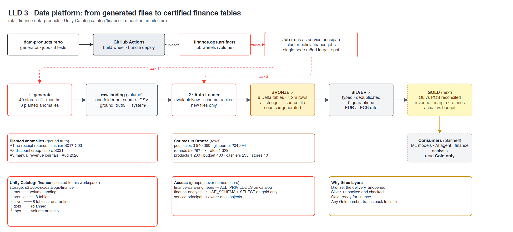

# LLD 3 · Data platform

**Contents:** [TL;DR](#tldr) · [Diagram](#diagram) · [Bronze, Silver, Gold](#bronze-silver-gold) · [Pipeline](#pipeline) · [Catalog layout](#catalog-layout) · [Access](#access) · [Sources and anomalies](#sources-and-anomalies) · [Deploy](#deploy)

Updated 2026-09-27. Back to [HLD](hld.md). Stories: [2.4](../stories/2.4-unity-catalog-on-our-s3.md) · [3.1](../stories/3.1-synthetic-accounting-data.md) · [3.2](../stories/3.2-catalog-and-bundle-deploy.md) · [3.3](../stories/3.3-first-job-in-the-private-vpc.md) · [4.1](../stories/4.1-silver-tables.md) · planned [4.2-4.4](../stories/README.md#epic-4--transform--quality).
Detail:
[data `cmdb.yml`](https://github.com/kheuchi/retail-finance-data-products/blob/main/cmdb.yml) → `sources`, `anomalies`, `volumes`, `pipeline` ·
[infra `cmdb.yml`](https://github.com/kheuchi/retail-finance-platform-infra/blob/main/cmdb.yml) → `stacks.databricks`.

## TL;DR

| Question | Answer |
|---|---|
| Where does data come from? | A seeded generator: 40 stores, 21 months, 8 sources. FX rates are real ECB data |
| How does it land? | CSV files in a Unity Catalog volume, then Auto Loader into Bronze |
| What is done? | Bronze and Silver: 8 tables each, 4.2m rows, 0 lost, 0 quarantined |
| What is next? | GL vs POS reconciliation, then Gold (finance tables) |
| Who reads what? | Engineers: everything. Analysts, ML and the agent: Gold only |
| How is it tested? | 15 tests in CI (generator + Silver rules on local Spark); the planted anomalies are the answer key |

## Diagram

## Bronze, Silver, Gold

> **TL;DR:** three layers of the same data, each more trustworthy than the last.
> The terms come from Databricks (the "medallion architecture") and are now common data engineering vocabulary.

| Layer | Think of it as | In this project |
|---|---|---|
| **Bronze** | The delivery, unopened | Files exactly as the systems sent them. Everything is text. Never edited ✅ |
| **Silver** | Unpacked and checked | Correct types, duplicates removed, bad rows set aside ([4.1](../stories/4.1-silver-tables.md)) ✅ |
| **Gold** | Ready for the boss | The books reconciled, then the few tables finance trusts: revenue, margin, refunds, budget variance |

If a number in Gold looks wrong, you can trace it back through Silver to the exact
file in Bronze. That trace is what an auditor asks for.

## Pipeline

> **TL;DR:** two jobs today (Bronze, Silver); Gold comes next.

| Step | Where | What |
|---|---|---|
| 1 · generate | Job `generate_and_ingest` | Writes CSV per source to `raw.landing` |
| 2 · ingest | Same job, Auto Loader | New files only, into `bronze.*`; adds source file and load time |
| 3 · Silver ✅ | Job `transform_silver` | Real types, dedup, bad rows to `silver.quarantine`, EUR via `silver.fx_daily` |
| 3b · Reconciliation (next) | | GL revenue vs POS net sales, per store and day |
| 4 · Gold (planned) | | Revenue, margin, refunds, actual vs budget |

## Catalog layout

> **TL;DR:** one catalog, five schemas, stored in our `dbx-uc` bucket and bound to this workspace only.

| Schema | Holds |
|---|---|
| `raw` | Volume `landing`: incoming files, ground truth, Auto Loader checkpoints |
| `bronze` | 8 tables, all text, never edited |
| `silver` | Clean, typed tables (next) |
| `gold` | Finance-ready tables (planned) |
| `ops` | Volume `artifacts`: job wheels |

## Access

> **TL;DR:** grants go to groups, never to named people.

| Principal | Grant |
|---|---|
| `finance-data-engineers` | ALL_PRIVILEGES on `finance` |
| `finance-analysts` | USE_CATALOG + USE_SCHEMA/SELECT on `gold` |
| Service principal | Owns every object; jobs run as it |

## Sources and anomalies

> **TL;DR:** realistic retail books with three frauds hidden inside.

| Source | Rows | | Anomaly | Where |
|---|---|---|---|---|
| pos_sales | 3,940,360 | | A1 no-receipt refunds | Cashier S017-C03, from 2026-08 |
| gl_journal | 204,294 | | A2 discount creep | Store S031, from 2026-06 |
| refunds | 53,297 | | A3 manual revenue journals | August 2026 close |
| fx_rates · products · budget · cashiers · stores | 1,329 · 1,200 · 480 · 235 · 40 | | | |

## Deploy

> **TL;DR:** Databricks Asset Bundle, deployed by GitHub Actions only.

Build wheel → upload to `ops.artifacts` → job on policy `finance-jobs`
(single node m6gd.large, spot). Required checks on main: lint + tests, bundle validate.
