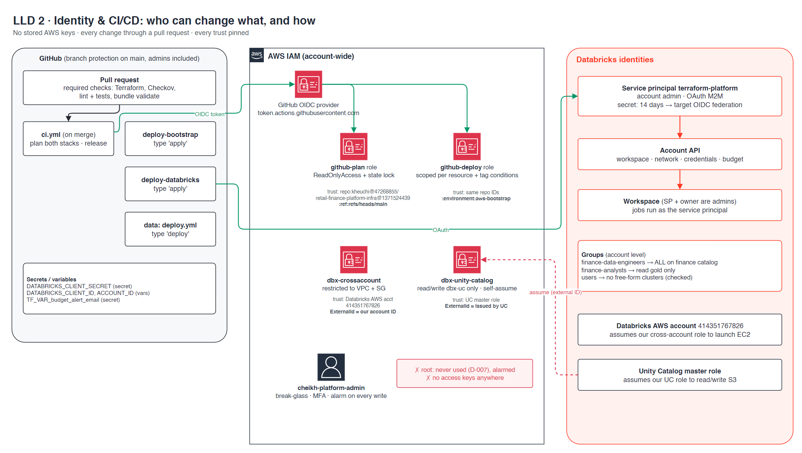

# LLD 2 · Identity & CI/CD

**Contents:** [TL;DR](#tldr) · [Diagram](#diagram) · [Change path](#change-path) · [AWS roles](#aws-roles) · [Databricks identities](#databricks-identities) · [People](#people) · [Known gaps](#known-gaps)

Updated 2026-09-26. Back to [HLD](hld.md). Stories: [1.1](../stories/1.1-aws-account-baseline.md) · [1.2](../stories/1.2-passwordless-cicd.md) · [1.3](../stories/1.3-least-privilege-deploy-role.md) · [1.5](../stories/1.5-security-review-going-public.md) · [2.3](../stories/2.3-workspace-as-code.md).
Detail:
[infra `cmdb.yml`](https://github.com/kheuchi/retail-finance-platform-infra/blob/main/cmdb.yml) → `iam`, `ci_cd` ·
[`cmdb.yml`](../../cmdb.yml) → `controls`, `decisions`.

## TL;DR

| Question | Answer |
|---|---|
| How does a change reach the cloud? | Pull request → required checks → merge → gated deploy workflow |
| AWS keys stored anywhere? | No. GitHub gets short-lived tokens via OIDC |
| Databricks auth? | Service principal `terraform-platform`, OAuth, secret in GitHub secrets |
| Can Databricks do anything in our account? | Only through two roles, each locked with an external ID |
| Root user? | Never used, alarmed |
| Human admin? | One break-glass user with MFA; every write raises an alarm |

## Diagram

## Change path

> **TL;DR:** nobody applies from a laptop. Main is protected, admins included.

| Step | What happens | Gate |
|---|---|---|
| 1 | Open a PR | Terraform validate, Checkov, lint + tests, bundle validate |
| 2 | Merge | `ci.yml` plans both stacks, cuts a release |
| 3 | Deploy infra | `deploy-bootstrap` / `deploy-databricks`, type `apply` to confirm |
| 4 | Deploy jobs | Data repo `deploy.yml`, type `deploy` to confirm |

Both infra deploy workflows share one concurrency group, so they never fight over the state lock.

## AWS roles

> **TL;DR:** four roles, each trust pinned to exactly one caller.

| Role | Assumed by | Trust pinned to | Can do |
|---|---|---|---|
| `github-plan` | CI on main | Numeric repo ID + `ref:refs/heads/main` | Read-only + state lock |
| `github-deploy` | Deploy workflow | Numeric repo ID + environment `aws-bootstrap` | Named resources, tag conditions |
| `dbx-crossaccount` | Databricks AWS account | External ID = our Databricks account | Launch EC2 in our VPC and SG only |
| `dbx-unity-catalog` | UC master role | External ID issued by UC | Read/write `dbx-uc` only |

Permissions are tested with the IAM policy simulator before each apply, including cases that must be denied.

## Databricks identities

> **TL;DR:** a machine owns everything; people get access through groups.

| Identity | Role |
|---|---|
| `terraform-platform` (service principal) | Account admin. Runs Terraform and owns all jobs and data objects |
| `finance-data-engineers` | ALL_PRIVILEGES on the finance catalog |
| `finance-analysts` | Read Gold only |
| `users` | No cluster creation (asserted by a Terraform check) |

## People

> **TL;DR:** one owner, break-glass only.

- `cheikh-platform-admin`: IAM user with MFA, for emergencies. Every non-read call alarms.
- Root: MFA on, no keys, never used (decision D-007).

## Known gaps

> Detail: [`cmdb.yml`](../../cmdb.yml) → `risks`

| Gap | Plan |
|---|---|
| Databricks secret lives 14 days (expires ~2026-10-08) | Move to GitHub OIDC federation |
| Front-end access is public (UI over internet) | Accepted for a demo; enterprise would add front-end PrivateLink or IP access lists |
| `terraform-platform` also deploys and runs data jobs (account admin running data code) | Split into platform, deployer, runner ([story 4.5](../stories/4.5-split-service-principals.md)) |
