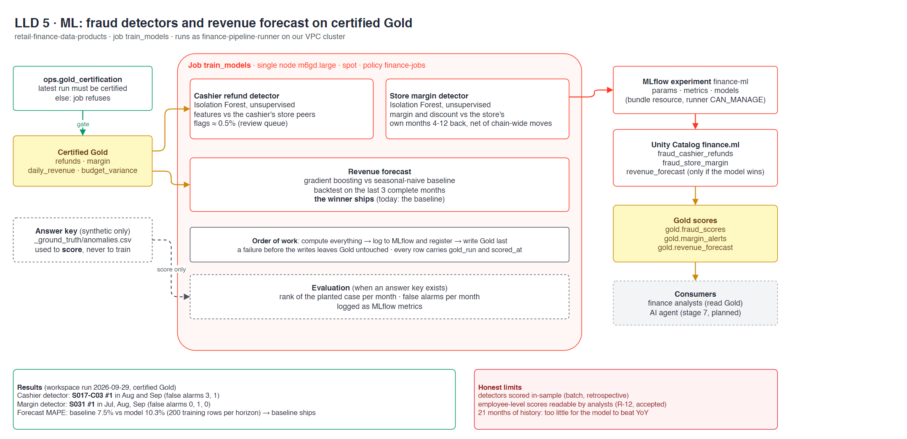

# LLD 5 · ML

**Contents:** [TL;DR](#tldr) · [Diagram](#diagram) · [Inputs and gate](#inputs-and-gate) · [Models](#models) · [Outputs](#outputs) · [Results](#results) · [Limits](#limits)

Updated 2026-10-01. Back to [HLD](hld.md). Stories: [5.1](../stories/5.1-fraud-detection.md) · [5.2](../stories/5.2-revenue-forecast.md).
Detail: [data `cmdb.yml`](https://github.com/kheuchi/retail-finance-data-products/blob/main/cmdb.yml) → `ml` · [`cmdb.yml`](../../cmdb.yml) → `risks` (R-12).
Code: `src/retail_finance_data/jobs/ml.py`, `resources/ml.job.yml`.

## TL;DR

| Question | Answer |
|---|---|
| What runs? | One job, `train_models`: two fraud detectors and a revenue forecast |
| Where? | On our own job cluster in the private VPC, as `finance-pipeline-runner` |
| On what data? | Gold only, and only if the latest Gold build is certified |
| Labels? | None for training; the planted anomalies only score the result |
| Where do models go? | MLflow experiment `finance-ml`, registered in Unity Catalog `finance.ml` |
| What do people read? | `gold.fraud_scores`, `gold.margin_alerts`, `gold.revenue_forecast` |

## Diagram

## Inputs and gate

> **TL;DR:** no certified Gold, no models.

The job reads the latest row of `ops.gold_certification` ([4.4](../stories/4.4-quality-and-lineage.md)) and
refuses to run unless it is certified. It reads four Gold tables; the answer key is optional and
used only for evaluation.

## Models

> **TL;DR:** two unsupervised detectors and a forecast that must earn its place.

| Model | Method | Compares each case with |
|---|---|---|
| Cashier refunds | Isolation Forest | The other cashiers of the same store, that month |
| Store margin drift | Isolation Forest | The store's own months 4-12 back, net of what moved for every store |
| Revenue forecast | Gradient boosting vs seasonal-naive baseline | A backtest on the last 3 complete months; the winner ships |

## Outputs

> **TL;DR:** compute, log, register, then write: Gold is never left half-updated.

| Output | Content |
|---|---|
| MLflow | Parameters, metrics (rank of the planted case, false alarms per month, MAPE per month), models |
| `finance.ml` | `fraud_cashier_refunds`, `fraud_store_margin` (+ `revenue_forecast` when the model wins) |
| Gold | Scores and forecasts, each row with `gold_run` and `scored_at` |

## Results

> **TL;DR:** both frauds ranked #1; the baseline forecast wins fairly.

| | Result (2026-09-29) |
|---|---|
| Cashier detector | S017-C03 #1 in Aug and Sep; 3 and 1 false alarms |
| Margin detector | S031 #1 in Jul, Aug, Sep; 0, 1, 0 false alarms |
| Forecast | Baseline 7.5% vs model 10.3% MAPE (200 training rows per horizon): baseline ships |

## Limits

> **TL;DR:** stated, not hidden.

| Limit | Why it is acceptable here |
|---|---|
| Detectors score in-sample | Batch, retrospective review queue, not real-time decisions |
| Employee-level scores readable by analysts (R-12) | Pseudonymous IDs, synthetic data; production would restrict to internal audit |
| 21 months of history | Too little for the model to beat a year-over-year baseline; revisit with more data |
