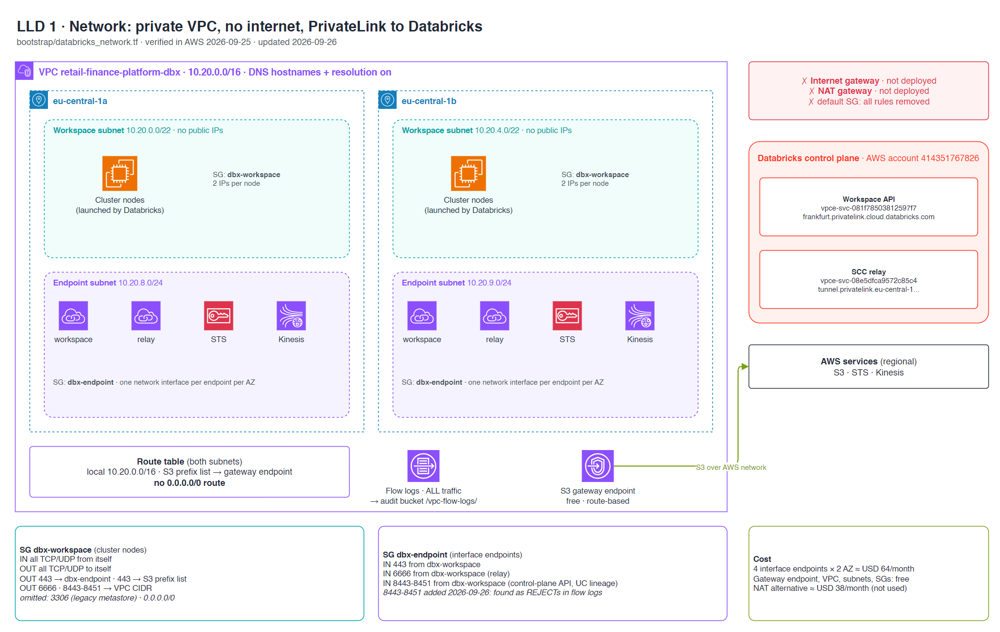

# LLD 1 · Network

**Contents:** [TL;DR](#tldr) · [Diagram](#diagram) · [Layout](#layout) · [Endpoints](#endpoints) · [Security groups](#security-groups) · [Proof](#proof) · [Cost](#cost)

Updated 2026-09-26. Back to [HLD](hld.md). Stories: [2.1](../stories/2.1-where-databricks-runs.md) · [2.2](../stories/2.2-private-network.md) · [3.3](../stories/3.3-first-job-in-the-private-vpc.md).
Detail:
[infra `cmdb.yml`](https://github.com/kheuchi/retail-finance-platform-infra/blob/main/cmdb.yml) → `stacks.bootstrap.resources.databricks_network`, `incidents`.
Code: `bootstrap/databricks_network.tf`.

## TL;DR

| Question | Answer |
|---|---|
| Internet access? | None. No internet gateway, no NAT, no `0.0.0.0/0` route |
| How do clusters reach Databricks? | Two PrivateLink endpoints: workspace API and SCC relay |
| How do they reach S3? | A free S3 gateway endpoint, on the AWS network |
| Other AWS services? | STS and Kinesis interface endpoints |
| High availability? | Two AZs, each with a workspace subnet and an endpoint subnet |
| Evidence? | Flow logs on all traffic; verified in AWS on 2026-09-25 |

## Diagram

## Layout

> **TL;DR:** one VPC, two AZs, two subnet types. Clusters and endpoints never share a subnet.

| Subnet | AZ a | AZ b | Holds |
|---|---|---|---|
| Workspace (/22) | 10.20.0.0/22 | 10.20.4.0/22 | Cluster nodes (2 IPs each), no public IPs |
| Endpoint (/24) | 10.20.8.0/24 | 10.20.9.0/24 | One network interface per endpoint |

The route table has the local route and the S3 prefix list. Nothing else.

## Endpoints

> **TL;DR:** four interface endpoints (paid) and one gateway endpoint (free).

| Endpoint | Type | Used for |
|---|---|---|
| Databricks workspace | Interface (PrivateLink) | REST API, cluster manager, UC calls (443, 8443-8451) |
| Databricks relay | Interface (PrivateLink) | Secure cluster connectivity tunnel (6666) |
| STS | Interface, private DNS | Clusters get temporary AWS credentials |
| Kinesis | Interface, private DNS | Databricks usage logs |
| S3 | Gateway | Data, logs, libraries |

## Security groups

> **TL;DR:** clusters talk to each other and to the endpoints. The endpoints accept only the clusters.

| SG | Direction | Rule |
|---|---|---|
| `dbx-workspace` | In | All TCP/UDP from itself |
| `dbx-workspace` | Out | All TCP/UDP to itself · 443 to `dbx-endpoint` and the S3 prefix list · 6666 and 8443-8451 to the VPC |
| `dbx-endpoint` | In | 443, 6666, 8443-8451 from `dbx-workspace` |
| default | Both | All rules removed |

Left out on purpose: 3306 (legacy Hive metastore, we use Unity Catalog) and any `0.0.0.0/0`.

## Proof

> **TL;DR:** checked in AWS, and the flow logs already paid for themselves.

- 2026-09-25: 0 internet gateways, 0 NAT, 0 default routes, 0 public IPs, 0 world-open rules.
- 2026-09-26: job library installs failed. Flow logs showed the endpoint SG rejecting
  ports 8443-8449. Added the ingress rule; the job then passed.

## Cost

> **TL;DR:** ~USD 64/month for privacy. Detail: infra `cmdb.yml` → `costs_usd_month`

| Item | USD/month |
|---|---|
| 4 interface endpoints × 2 AZ | ~64 |
| S3 gateway endpoint, VPC, subnets, SGs | 0 |
| NAT alternative (not used) | ~38 + data |
