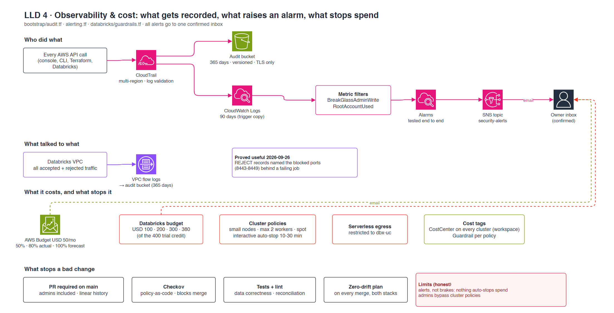

# LLD 4 · Observability & cost

**Contents:** [TL;DR](#tldr) · [Diagram](#diagram) · [Audit trail](#audit-trail) · [Network evidence](#network-evidence) · [Cost controls](#cost-controls) · [Change gates](#change-gates) · [Limits](#limits)

Updated 2026-09-26. Back to [HLD](hld.md). Detail:
[infra `cmdb.yml`](https://github.com/kheuchi/retail-finance-platform-infra/blob/main/cmdb.yml) → `stacks.bootstrap.resources`, `costs_usd_month`, `checkov` ·
[`cmdb.yml`](../../cmdb.yml) → `controls`, `risks`.

## TL;DR

| Question | Answer |
|---|---|
| Who did what? | CloudTrail, every region, kept 365 days in the audit bucket |
| What raises an alarm? | Any root activity, any write by the break-glass admin |
| What talked to what? | VPC flow logs, all traffic, in the audit bucket |
| What limits spend? | AWS budget USD 50/month, Databricks budget alerts, cluster policies |
| What stops a bad change? | PR + Checkov + tests + zero-drift plan |
| Where do alerts go? | One confirmed email inbox |

## Diagram

## Audit trail

> **TL;DR:** S3 is the record, CloudWatch is the trigger.

| Piece | Setting |
|---|---|
| CloudTrail | Multi-region, global events, log file validation |
| Audit bucket | 365 days, versioned, TLS only |
| CloudWatch Logs | 90-day copy, feeds the metric filters |
| Metric filters → alarms | `BreakGlassAdminWrite`, `RootAccountUsed` (both tested) |
| SNS `security-alerts` | Email, subscription confirmed |

## Network evidence

> **TL;DR:** flow logs record accepted and rejected traffic.

On 2026-09-26 the REJECT records named the ports (8443-8449) behind a failing job.
The fix took one rule. Detail: infra `cmdb.yml` → `incidents`.

## Cost controls

> **TL;DR:** alerts early, small machines by default.

| Control | Setting |
|---|---|
| AWS Budget | USD 50/month: 50% and 80% actual, 100% forecast |
| Databricks budget | USD 100 / 200 / 300 / 380 of the 400 trial credit |
| Cluster policies | m6gd/m5d large or xlarge, max 2 workers, spot, auto-stop 10-30 min |
| Serverless egress | Restricted to the `dbx-uc` bucket |
| Tags | `CostCenter` on every cluster, `Guardrail` per policy |

## Change gates

> **TL;DR:** four checks before anything reaches the cloud.

| Gate | Catches |
|---|---|
| PR required on main (admins included) | Unreviewed changes |
| Checkov | Insecure Terraform |
| Tests + lint | Broken data logic |
| Zero-drift plan after merge | Console edits, config drift |

## Limits

> Detail: [`cmdb.yml`](../../cmdb.yml) → `risks`

| Limit | Why it is OK here |
|---|---|
| Alerts, not brakes: nothing auto-stops spend | Short trial, owner watches the inbox, teardown on 2026-10-06 |
| Workspace admins bypass cluster policies | Only the owner and the service principal are admins |
