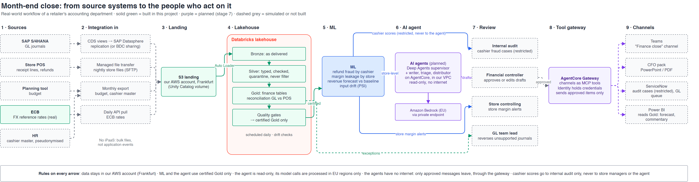

# Business case: finance data, ML and AI agents for the month-end close

**Contents:** [TL;DR](#tldr) · [Glossary](#glossary) · [The company](#the-company) · [Today's close](#todays-close-as-is) · [Target workflow](#target-workflow-to-be) · [Use cases](#use-cases) · [ML or agent?](#ml-or-agent) · [Benefits and KPIs](#benefits-and-kpis) · [Market tools](#what-large-retailers-use) · [Constraints and risks](#constraints-and-risks) · [Scope](#scope-built-vs-simulated)

Day 0 · Conception · 2026-10-04. Next: [stakeholders](stakeholders.md) · [benchmark](benchmark.md) · [ADRs](adr/README.md).
Detail: [`cmdb.yml`](../../cmdb.yml) → `conception`, `decisions`.

## TL;DR

| Question | Answer |
|---|---|
| Who? | The accounting department of a large grocery retailer (Germany and Switzerland, stores and online) |
| Problem | The month-end close relies on extracts, Excel and sampling: frauds and booking errors surface months late, and nobody can trace a reported number to its source |
| Solution | A governed lakehouse that reconciles every store-day, ML that ranks suspicious cashiers and stores, a forecast that must beat a baseline, and (planned) an AI agent that drafts the close commentary for a controller to approve |
| Real or simulated? | The workflow is real-world; we build the core (lakehouse, ML; the agent is next) and simulate the edges (SAP, store systems, Teams, case management) |
| Measured by | Store-days reconciled, time to detect, forecast error, controller hours on commentary, days to close |

## Glossary

> **TL;DR:** every abbreviation used in the conception pack, in plain words.

| Term | Meaning |
|---|---|
| **CFO** | Chief Financial Officer: head of finance; sponsors the project, signs the accounts |
| **Financial controller** | Senior accountant who reviews the numbers and writes or approves the commentary |
| **FP&A** | Financial Planning & Analysis: the team that builds budgets and forecasts |
| **GL** | General ledger: the accounting books, every amount booked to an account |
| **POS** | Point of sale: the tills; every receipt line and refund |
| **Month-end close** | The days after each month when accounting checks, adjusts and reports the month |
| **CFO pack** | The monthly report to the CFO: key figures and written commentary on variances |
| **Variance** | The difference between actual and budget (or last year) |
| **Reconciliation** | Proving two independent records agree, and explaining every difference |
| **Journal** | One accounting entry; debits must equal credits |
| **Accrual** | An expense booked in the month it belongs to, before the invoice arrives |
| **ERP** | Enterprise resource planning: the company's core system (here SAP S/4HANA) |
| **SAP S/4HANA** | SAP's current ERP; finance lines live in the universal journal (table ACDOCA) |
| **SAP Datasphere / BDC** | SAP's data products for getting data out of SAP; BDC = SAP Business Data Cloud |
| **CDS view** | A defined, supported view on SAP tables, used for extraction |
| **SFTP / MFT** | Secure file transfer / managed file transfer: how nightly files move between systems |
| **iPaaS** | Integration platform as a service (MuleSoft, Workato): connects business applications |
| **MCP** | Model Context Protocol: the open standard for agents to call tools |
| **AgentCore** | AWS's services to run agents (Runtime), expose tools (Gateway), hold credentials (Identity), set rules (Policy) |
| **LLM** | Large language model (here Claude) |
| **ServiceNow** | Ticketing and case-management tool ("SNOW") |
| **Power BI** | Microsoft's dashboard tool; reads tables, it does not receive messages |
| **Teams** | Microsoft's chat tool |
| **Internal audit** | The independent team that investigates fraud and checks controls |
| **Works council** | Elected staff representatives; in Germany they must agree to systems that monitor employees |
| **DPO / DPIA** | Data protection officer (GDPR advisor) / data protection impact assessment (risk study before processing personal data) |
| **GDPR** | EU General Data Protection Regulation |
| **EU AI Act** | EU law classifying AI systems by risk; monitoring workers is high-risk |
| **RACI** | Responsible, Accountable, Consulted, Informed |
| **KPI** | Key performance indicator |
| **MAPE** | Mean absolute percentage error: how far a forecast is off, on average |
| **PSI** | Population stability index: how much a data distribution has shifted |

## The company

> **TL;DR:** a fictional retailer, modelled on a real grocery chain's finance organisation.

| | |
|---|---|
| Business | Grocery retail: stores in Germany (EUR) and Switzerland (CHF), plus an online shop |
| Systems | SAP S/4HANA for finance (general ledger, universal journal ACDOCA), a central POS hub collecting every till, a planning tool for budgets |
| Finance team | Group accounting (general ledger, close), store controlling, FP&A (forecast, budget), internal audit |
| This project's slice | 40 stores, 21 months, about 1/1,000 of a real chain's volume ([3.1](../stories/3.1-synthetic-accounting-data.md)) |

## Today's close (as-is)

> **TL;DR:** spreadsheets, samples and late surprises.

| Step | How it is done today | Pain |
|---|---|---|
| Collect | Accountants export GL lines from SAP and POS summaries from the store system into Excel | Copies of copies; no single version |
| Reconcile GL vs POS | POS revenue posts to the GL through the POS interface; accountants check a sample of stores and days for manual journals and interface gaps | A fake journal on an unsampled day passes |
| Refund fraud | Found by store audits or tip-offs, months later | Losses accumulate; the trail is cold |
| Margin leakage | Noticed when a store's quarterly margin looks odd | Discount abuse runs for a quarter |
| Forecast | Controllers extend last year in Excel, by hand | Unmeasured accuracy, key-person dependency |
| Commentary | Controllers write the CFO pack variance text by hand, in PowerPoint | Days of senior time each month; numbers retyped |
| Audit trail | Emails and file versions | "Where does this number come from?" takes days |

## Target workflow (to-be)

> **TL;DR:** sources land raw in our account, the lakehouse certifies them, ML and the agent work on certified data only, and people approve before anything leaves finance.

| # | Stage | Real-world tool | In this project |
|---|---|---|---|
| 1 | **Sources** | SAP S/4HANA (GL journals), store POS (receipt lines, refunds), planning tool (budget), ECB (FX rates), HR (cashier master, pseudonymised at source) | Simulated by the generator; ECB rates are real |
| 2 | **Integration in** | SAP: CDS extraction views on the universal journal through SAP Datasphere replication to S3 (needs SAP's outbound integration licence), or SAP Business Data Cloud sharing to Databricks. POS: nightly files from the central POS hub through managed file transfer (SFTP). ECB: daily API pull. Budget: monthly export | Simulated: files written to the landing volume |
| 3 | **Landing** | S3 in our AWS account, Frankfurt | Built (Unity Catalog volume) |
| 4 | **Lakehouse** | Databricks: Bronze (as delivered) → Silver (typed, checked, quarantine) → Gold (finance tables), reconciliation, quality gates, certification | Built ([4.1](../stories/4.1-silver-tables.md)-[4.4](../stories/4.4-quality-and-lineage.md)) |
| 5 | **ML** | Fraud detectors, margin drift, revenue forecast, drift monitoring | Built ([5.1](../stories/5.1-fraud-detection.md), [5.2](../stories/5.2-revenue-forecast.md), [6.2](../stories/6.2-drift-checks.md)) |
| 6 | **AI agent** | Reads certified Gold, store-level results and exceptions; drafts the close commentary with citations; never sees cashier-level data | Planned (stage 7, [ADR-006](adr/ADR-006-agent-platform.md)) |
| 7 | **Review** | Controller approves or edits each draft; internal audit owns fraud cases | Simulated: a review status on the draft table |
| 8 | **Tool gateway** | AgentCore Gateway: each channel is an MCP tool; Identity holds the channel credentials; Policy says which agent may call which tool; the send tools refuse unapproved items | Planned (stage 7) |
| 9 | **Channels** | Teams "Finance close" channel; CFO pack (PowerPoint/PDF); ServiceNow cases for internal audit and the GL team; Power BI reads Gold (forecast, approved commentary) through Databricks SQL | Simulated: a stand-in channel behind the same tool if no Microsoft 365 tenant |

**Why no iPaaS:** on the way in, millions of receipt lines a day are bulk files; file transfer to
S3 with Auto Loader is the standard, cheaper path (iPaaS tools are designed and priced for application
integration: MuleSoft by flows and messages, Workato by tasks). On the way out, the agent needs a
"middle man" so it never holds channel credentials and every send is checked and logged; for agents
that middle man is now a **tool gateway** (AgentCore Gateway, MCP), not an iPaaS. A company that
already runs an iPaaS can expose its connectors as MCP tools behind the same gateway
([ADR-004](adr/ADR-004-ingestion-integration.md), [ADR-006](adr/ADR-006-agent-platform.md)).

**Why the agent does not call Teams directly:** each agent would then store Teams, ServiceNow and
mail credentials, with no single place to allow, log or revoke what it sends. The gateway is that place.
The agent runs inside our VPC with no internet; only approved messages leave, through the gateway.

**Who receives what:**

| Output | Goes to | Channel | Never to |
|---|---|---|---|
| Reconciliation exceptions (unsupported journals) | GL team lead | ServiceNow work queue | — |
| Cashier refund scores (employee-level) | Internal audit only | ServiceNow case, restricted | Store managers, the agent, the CFO pack (GDPR, works council, R-12) |
| Store margin alerts (not personal data) | Store controlling | Power BI, ServiceNow | — |
| Forecast with range | FP&A, CFO | Power BI | — |
| Draft close commentary | Financial controller (approves) | Review → Teams, CFO pack, and `gold.close_commentary` for Power BI, after approval | Anyone before approval |

## Use cases

> **TL;DR:** four built, one planned (the agent), eight candidates.

| Use case | Technique | Before | After | Status |
|---|---|---|---|---|
| GL vs POS reconciliation | Rules, exact to the cent | Sample of store-days | Every store-day, each difference explained | Built (4/4 fake journals, 0 false alarms) |
| Refund fraud by cashier | ML, unsupervised | Store audits, tip-offs | Monthly ranked review queue | Built (planted case #1) |
| Margin leakage by store | ML, unsupervised | Quarterly review | Monthly, against the store's own past | Built (planted case #1) |
| Revenue forecast | ML vs seasonal baseline | Excel, unmeasured | Measured; the better method ships | Built (baseline wins) |
| Close commentary and distribution | **AI agent** (supervisor + sub-agents, read-only tools, gateway for channels) | Days of controller writing, manual emails | Cited draft in minutes; approved items sent to the right channel | Planned (stage 7) |
| Three-way match (PO, receipt, invoice) | Rules + ML for exceptions | Manual exception handling | Auto-match, humans on exceptions | Candidate |
| Accrual proposals | Agent on open POs and receipts | Spreadsheet estimates | Proposed accruals with evidence | Candidate |
| Intercompany reconciliation (DE-CH) | Rules + agent explanations | Email ping-pong | Matched, differences explained | Candidate |
| Duplicate vendors and payments | ML (entity matching) | Annual audit | Before payment run | Candidate |
| Expense audit | ML + agent | Sampling | All claims scored | Candidate |
| Cash forecast | ML | Treasury spreadsheet | Daily, with range | Candidate |
| Close checklist orchestration | Agent | Checklist in Excel | Status, blockers, reminders | Candidate |
| Card and cash settlement to bank | Rules | Manual matching of acquirer payouts | Every payout matched to POS takings | Candidate |

**Build or buy:** close tools such as BlackLine, SAP Advanced Financial Closing or Workiva cover
checklists, reconciliations and reporting out of the box. A company with one of them would plug
the lakehouse's certified data and the models into it rather than rebuild those features.

## ML or agent?

> **TL;DR:** ML finds patterns in numbers; the agent reads results and writes for people. Mixing them up is the common mistake.

| | ML models | AI agent |
|---|---|---|
| Does | Scores, ranks, forecasts | Plans its own steps; reads certified results, explains, drafts, triages, sends approved items |
| Input | Feature tables | Gold tables, store-level results, reconciliation exceptions, through read-only tools (no employee-level data) |
| Output | Numbers with a known error | Text with citations, for a human |
| Tested by | Backtests, planted cases | Every figure in the draft matches Gold; approval rate; edits needed |
| Can act? | No | Only through gateway tools, only after approval; read-only on finance data; posting entries stays human |

## Benefits and KPIs

> **TL;DR:** measured from this build where we can; targets elsewhere are assumptions to confirm with finance.

| KPI | Before | This build shows | Target (assumption) |
|---|---|---|---|
| Store-days reconciled | A sample | 21,222 of 21,222, to the cent | 100% |
| Fake revenue journals caught | When a sample hits | 4 of 4, 0 false alarms | All with no POS behind them |
| Time to detect refund fraud | Months | Ranked #1 in the first month it ran | Within the month |
| Forecast error | Not measured | Baseline 7.5% MAPE (backtest) | Tracked monthly; model must beat baseline |
| Commentary effort | Days of controller time | To measure in stage 7 | Review instead of writing |
| Traceability | Days of digging | One number → file in one query ([4.4](../stories/4.4-quality-and-lineage.md)) | Any Gold number |

## What large retailers use

> **TL;DR:** specialised tools exist for each use case; we build in-house to show the method, and say so.

| Need | Typical tools in large companies |
|---|---|
| Refund and till fraud (loss prevention) | Appriss Retail (returns fraud), Agilence (POS exception analytics), Everseen (vision at self-checkout); audit analytics such as Diligent HighBond or CaseWare IDEA; SAS for bank-grade fraud |
| Fraud case management | ServiceNow, or the case module of the tools above |
| Financial forecast and budget | SAP Analytics Cloud (planning), Anaplan, Oracle EPM, Workday Adaptive Planning |
| Demand and sales forecast (retail) | RELEX, Blue Yonder, o9 |
| Close management | BlackLine, SAP Advanced Financial Closing, Workiva |
| In-house (like this project) | Databricks or SageMaker, when the company wants control, owns the data science, or needs what the tools do not cover |

## Constraints and risks

> **TL;DR:** finance data, employee data and AI regulation set the rules.

| Constraint | Consequence for the design |
|---|---|
| Internal control over financial reporting (segregation of duties) | Separate identities for build, deploy, run; agent read-only; human approval |
| GDPR and works council (cashier-level scores) | Pseudonymous IDs, scores for internal audit only (R-12); DPIA before production |
| EU AI Act | Ranking employees for investigation likely counts as high-risk (monitoring workers, Annex III): human oversight, logging, legal review before production. Timelines may shift; Swiss stores fall under Swiss law |
| EU data residency | Data in Frankfurt; the agent's model calls processed in EU regions only |
| No public egress for finance data | Private VPC, PrivateLink ([ADR-003](adr/ADR-003-compute-network.md)) |
| Portfolio budget (USD 50/month AWS budget, Databricks trial) | The private endpoints cost more than the budget per month (~USD 64, +17 for Bedrock): the build runs for a time-boxed window, teardown 2026-10-06 |

## Scope: built vs simulated

> **TL;DR:** the core is real; the edges are simulated.

| Built | Simulated | Not built |
|---|---|---|
| AWS foundation, private network, Databricks workspace, Unity Catalog, Bronze/Silver/Gold, reconciliation, quality gates, ML, scheduling, drift checks; AI agent planned (stage 7) | SAP, POS and planning systems (synthetic files), the controller's approval (a status column), channels (a stand-in behind the gateway) | Teams, ServiceNow, Power BI, CFO pack (real tenants) |
